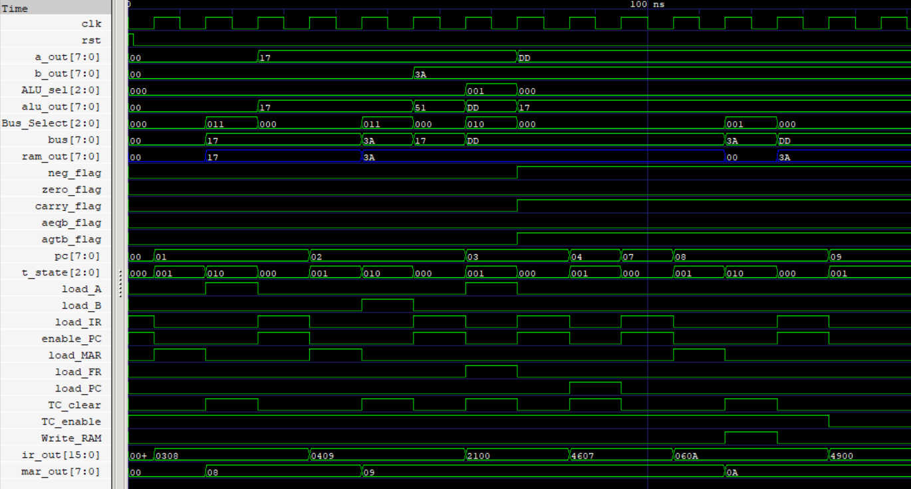
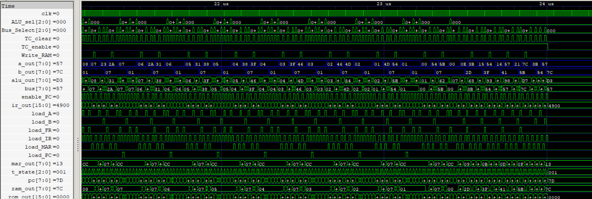

# Harvard Processor
The processor follows a **Harvard architecture** with separate program and data memories, a custom Instruction Set Architecture (ISA), a **hardwired control unit**, and a **multiplexer-based internal data bus** for datapath communication.

> Demonstrated at 8-bit but configurable to any data width at instantiation.

## 🛠️ Tools & Technologies


## 🧩 System Organization
<p align="center">
  
</p>

## 📚 Documentation
- [Instruction Set Architecture](ISA.md)
- [Computer Organization](Organization.md)

## ⚖️ Maximum of Two Numbers

This program compares two unsigned 8-bit values stored in RAM address `0x08` and `0x09` and writes the larger value back to RAM address `0x0A`. 

`Max.asm`

```asm

        LDA 0x08        ; Load first number
        LDB 0x09        ; Load second number

        PASS A          ; Update status Flags
        JLT STORE_B     ; If A < B, branch to store second number

        STA 0x0A        ; Store first number as maximum
        JMP END         ; Skip alternate path

STORE_B:
        STB 0x0A        ; Store second number as maximum

END:
        HLT             ; End program
```

**Program Source:** [Max.hex](Computer/Programs/Max.hex)

> The waveform captures the branch-taken execution path, where the processor skips the alternate instruction sequence after evaluating the Negative flag, demonstrating conditional control flow.

`[Max[0x17(23), 0x3A(58)] = 0x3A(58)]`
<p align="center">
  
  <br>
  <sub>RTL simulation of the processor executing the Maximum of Two Numbers program, illustrating instruction fetch, ALU computation, memory operations, and control flow .</sub>
</p>

## ✖️ Multiplication Kernel

This program multiplies two unsigned 8-bit values using repeated addition. The multiplicand is stored in RAM address `0x07` and the multiplier stored in RAM address `0x08` acts as the loop counter. A constant value of 1 is stored in RAM address `0x06` for decrementing the counter, and the accumulated product is written to RAM address `0x09`.

`Mult.asm`

```asm

LOOP:
    LDB 0x06          ; Load constant 1
    LDA 0x08          ; Load multiplier (loop counter)

    PASS A            ; Check if counter is zero
    JZ DONE           ; Jump if counter is zero

    SUB               ; Decrement counter
    STA 0x08          ; Store updated counter

    LDA 0x09          ; Load accumulated result
    LDB 0x07          ; Load multiplicand
    ADD               ; Add multiplicand to result
    STA 0x09          ; Store updated result

    LDA 0x08          ; Reload counter
    PASS A            ; Update status flags
    JNZ LOOP          ; Repeat until counter becomes zero

DONE:
    LDA 0x09          ; Load final product
    HLT               ; End program
```
**Program Source:** [Mult.hex](Computer/Programs/Mult.hex)

> The waveform below shows the execution of the Integer Multiplication program implemented using repeated addition. The processor repeatedly executes the fetch-decode-execute cycle, decrementing the multiplier while accumulating the multiplicand.

`[0x11(17) x 0x0D(13) = 0xDD(221)]`
<p align="center">
  
  <br>
  <sub>RTL simulation of the processor executing the Multiplication program, illustrating iterative execution until final product is produced.</sub>
</p>

## 🔢 2×2 Matrix Multiplication

This program implements unsigned 2×2 matrix multiplication entirely in software using the custom ISA. It is built by invoking multiplication kernel 8 times, followed by additions to combine the partial products. The input matrices are stored in RAM locations `0x00-0x03` and `0x04-0x07`, while the resulting matrix is written to `0x10-0x13`. 

```
 A = [ A  B ]   B = [ E  F ]   A × B = [ C00 = AE + BG  C01 = AF + BH ]
     [ C  D ]       [ G  H ]           [ C10 = CE + DG  C11 = CF + DH ]
```

*Memory Layout*
| A | B | C | D | E | F | G | H | AE | BG |
|:-:|:-:|:-:|:-:|:-:|:-:|:-:|:-:|:--:|:--:|
| `0x00` | `0x01` | `0x02` | `0x03` | `0x04` | `0x05` | `0x06` | `0x07` | `0x08` | `0x09` |
| AF | BH | CE | DG | CF | DH | C00 | C01 | C10 | C11 |
| `0x0A` | `0x0B` | `0x0C` | `0x0D` | `0x0E` | `0x0F` | `0x10` | `0x11` | `0x12` | `0x13` |

`Matmul.asm`
```asm
; For brevity, the multiplication kernel is abstracted as multiply(x, y).

; Compute C00 = A×E + B×G
multiply(0x00, 0x04)      ; Compute A×E
STA 0x08                  ; Store AE
multiply(0x01, 0x06)      ; Compute B×G
STA 0x09                  ; Store BG
LDA 0x08                  ; Load AE
LDB 0x09                  ; Load BG
ADD                       ; Compute AE + BG
STA 0x10                  ; Store C00

; Compute C01 = A×F + B×H
multiply(0x00, 0x05)      ; Compute A×F
STA 0x0A                  ; Store AF
multiply(0x01, 0x07)      ; Compute B×H
STA 0x0B                  ; Store BH
LDA 0x0A                  ; Load AF
LDB 0x0B                  ; Load BH
ADD                       ; Compute AF + BH
STA 0x11                  ; Store C01

; Compute C10 = C×E + D×G
multiply(0x02, 0x04)      ; Compute C×E
STA 0x0C                  ; Store CE
multiply(0x03, 0x06)      ; Compute D×G
STA 0x0D                  ; Store DG
LDA 0x0C                  ; Load CE
LDB 0x0D                  ; Load DG
ADD                       ; Compute CE + DG
STA 0x12                  ; Store C10

; Compute C11 = C×F + D×H
multiply(0x02, 0x05)      ; Compute C×F
STA 0x0E                  ; Store CF
multiply(0x03, 0x07)      ; Compute D×H
STA 0x0F                  ; Store DH
LDA 0x0E                  ; Load CF
LDB 0x0F                  ; Load DH
ADD                       ; Compute CF + DH
STA 0x13                  ; Store C11

; Load output matrix
LDA 0x10                  ; Load C00
LDB 0x11                  ; Load C01
LDA 0x12                  ; Load C10
LDB 0x13                  ; Load C11

HLT                       ; End program
```

**Program Source:** [Matmul.hex](Computer/Programs/Matmul.hex)

> This program demonstrates that non-trivial linear algebra can be implemented entirely in software using a minimal instruction set consisting of arithmetic, memory operations, conditional branching, and loops.

```
A = [07 09]   B = [02 03]   A × B = [3B 54]
    [0B 0D]       [05 07]           [57 7C]
```

<p align="center">
  
</p>

<p align="center">
<sub>Waveform showing execution of the software-based 2×2 matrix multiplication program. The final values loaded into the A and B registers correspond to the computed output matrix stored at RAM locations <code>0x10</code>-<code>0x13</code>.</sub>
</p>

## 📊 Performance Evaluation

The processor was evaluated using three benchmark programs: Maximum of Two Numbers, Unsigned Multiplication, and 2×2 Matrix Multiplication.

An architectural optimization eliminating the Memory Address Register (MAR) increased the proportion of the ISA executing in 2 T-states from 84% to 100%, resulting in a uniform **2-cycle instruction execution** across the ISA.

| Benchmark | Maximum Speedup | Maximum Clock Cycles Saved |
|-----------|----------------|---------------------------|
| Maximum | 1.250× | 3 |
| Unsigned Multiplication | 1.269× | 1786 |
| 2×2 Matrix Multiplication | 1.231× | 12256 |

Detailed analytical performance models, Amdahl's Law validation, workload analysis, and experimental methodology are documented in the [Architectural Studies](Architectural-Studies/MAR_Optimization) folder.

## 🔬 Physical Characterization

The following table summarizes post-synthesis implementation results obtained using the Sky130 HD standard-cell library.
Timing results correspond to constrained static timing analysis using a 10 ns clock period, 1 ns input delay, and 1 ns output delay.

> Technology: Sky130HD

| Module | Estimated Area | Critical Path | Estimated Fmax | Estimated Total Power|
| ---------- | ---------- | ---------- | ---------- | ---------- |
| [General Purpose Registers](Register) | 320.3072 µm² | 1.41 ns | ~709 MHz | 39.8 µW |
| [Arithmetic and Logic Unit](ALU) | 877.0912 µm² |3.21 ns | ~311 MHz | 349 µW |
| [Program Counter](PC) | 444.176 µm² | 1.78 ns | ~562 MHz | 48.1 µW |
| [ROM (256x8)](ROM) | 2277.184 µm² | 2.85 ns | ~351 MHz | 888 µW |
| [RAM (256x8)](RAM) | 75862.7584 µm² | 5.18 ns | ~208 MHz | 9.88 mW |
| [Memory Address Register](MAR) | 320.3072 µm² | 1.41 ns | ~709 MHz | 39.8 µW |
| [Flags Register](FR) | 200.192 µm² | 1.41 ns | ~709 MHz | 24.9 µW |
| [Instruction Register](IR) | 640.6144 µm² | 1.41 ns | ~709 MHz | 79.7 µW |
| [T-State Counter](TC) | 125.12 µm² | 1.38 ns | ~725 MHz | 15.6 µW |
| [Control Unit](CU) | 359.0944 µm² | 2.29 ns | ~437 MHz | 41.4 µW |
| [Computer](Computer) | 80347.06 µm² | 25.55 ns | ~39 MHz | 8.67 mW |

> Note: The reported RAM area and timing correspond to a behavioral Verilog memory synthesized entirely using Sky130 HD standard cells. Since no dedicated SRAM macro was used, the memory is implemented using flip-flops and associated decode/multiplexing logic, making it the dominant contributor to overall chip area and critical path delay.

## 🔍 Verification

The RTL is verified using both traditional Verilog testbenches and modern Cocotb self-checking testbenches.

Verification methodology includes:
- **Directed Testing** - Handcrafted test cases covering reset, load, hold, increment, and control priority.
- **Random Testing** - Python-generated randomized inputs validated against a software reference model using self-checking assertions.
- **Exhaustive Testing** - Complete input-space verification for combinational modules such as the ALU by testing every possible input combination.

## ⚙️ Implemented Modules

| Module               | Description                                         | Status |
| -------------------- | --------------------------------------------------- | ------ |
| ALU                  | Arithmetic and logical operations with status flags | ✅     |
| A Register           | Loadable general-purpose register                   | ✅     |
| B Register           | Loadable general-purpose register                   | ✅     |
| Program Counter      | Instruction address generation                      | ✅     |
| ROM                  | Program storage subsystem                           | ✅     |
| RAM                  | Data storage subsystem                              | ✅     |
| Memory Address Register | Stores RAM address that needs to be accessed     | ✅     |
| Flags Register       | Stores status flags of computation                  | ✅     |
| Instruction Register | Stores current instruction                          | ✅     |
| T-State Counter      | Tracks the T-state of an instruction                | ✅     |
| Control Unit         | Generates control signals                           | ✅     |

## ⬇️ Download This Repository

### 🪟 Windows
Download → [download_repos.bat](./download_repos.bat)
``` 
Double-click it and pick the repo(s) you want.
```

### 🐧 Linux / macOS
Download → [download_repos.sh](./download_repos.sh)
```
bash

chmod +x download_repos.sh
./download_repos.sh
```

> Always downloads the latest version.

## 📜License
- Source code and HDL files are licensed under the MIT License.
- Documentation, diagrams, images, and PDFs are licensed under Creative Commons Attribution 4.0 (CC BY 4.0).
